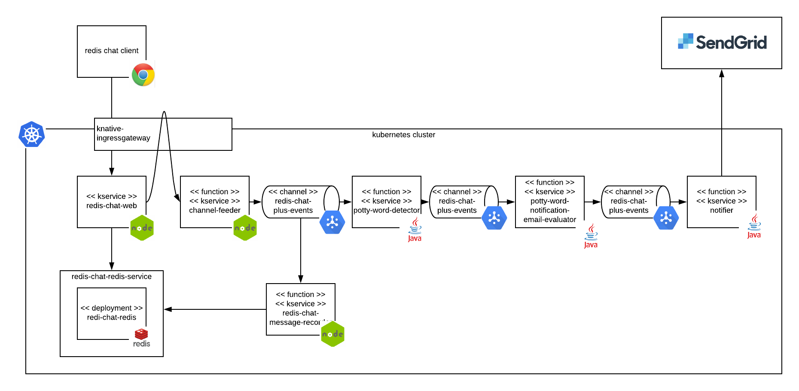

# Redis Chat Plus Demo

Extended demo leveraging kubernetes, Knative, and riff.  This extends the existing redis-chat-app demo, which consists of a node web app accessing redis to provide chat functionality.  The extension adds riff functions to handle back-end services associated with evaulating the messages in the chat for bad words and notifying if found.  It encorporates:

* mild use of CQRS pattern to submit a command event that updates the data store and allows for parallel processing
* use of GCP PubSub for Knative bus implementation.  Provides messaging reliability
* demostrates out of cluster stervice calls
* multiple subscribers to a single channel
* node and java functions
* custom domains



This demo comprises seven repos:
*  https://github.com/doddatpivotal/channel-feeder.git - Node function to post messages on a channel
*  https://github.com/doddatpivotal/potty-word-detector.git - Java function to detect potty words
*  https://github.com/doddatpivotal/potty-word-notification-email-evaluator.git - Java function to determine whether to send email based upon potty word result
*  https://github.com/doddatpivotal/notifier.git - Java funciton to send emails
*  https://github.com/doddatpivotal/redis-chat-message-recorder.git - Node function to recorde messages in redis
*  https://github.com/doddatpivotal/redis-chat-app.git - Base redis chat web app
*  https://github.com/doddatpivotal/redis-chat-plus-demo-setup.git - Setup instructions

## prereqs

1. [Install riff on GKE](https://projectriff.io/docs/getting-started/gke/)
2. Update your dns name to point to knative ingressgateway

Retrieve the IP address returned from the following command and update your custom dns with this IP.
```bash
kubectl get svc knative-ingressgateway --namespace istio-system --output 'jsonpath={.status.loadBalancer.ingress[0].ip}'
```

3. Update config for your [custom domain](https://github.com/knative/docs/blob/master/serving/using-a-custom-domain.md)

4. Open up [outbound network access](https://github.com/knative/docs/blob/master/serving/outbound-network-access.md)

5. Setup GCP PubSub Bus
Run scripts from [Knative Eventing docs](https://github.com/knative/docs/tree/master/eventing) for GCP PubSub

Follow Steps 2, 3, 4 from [GCP PubSub Bus](https://github.com/knative/eventing/blob/master/config/buses/gcppubsub/README.md) following steps 2, 3, and 4

6. Setup Email to/from
Follow instructions at [potty-word-notification-email-evaluator repo](https://github.com/doddatpivotal/potty-word-notification-email-evaluator/blob/master/README.md) to set DOCKER_ID and to/from environment variables

7. Setup Send Grid Email Relay
Follow instructions at [notifier repo](https://github.com/doddatpivotal/notifier/blob/master/README.md) to  STMP environment variables

8. Create configmap providing feeder url with custom domain for redis-chat-app.
```bash
kubectl create configmap redis-chat-web-config --from-literal=FEEDER_URL="http://channel-feeder.default.<CUSTOM_DOMAIN>.com"
```


## instructions

1. Clone the setup repo and the two project repos into a single local directory:

```bash

mkdir redis-chat-demo-plus-demo
cd redis-chat-demo-plus-demo
git clone https://github.com/doddatpivotal/channel-feeder.git
git clone https://github.com/doddatpivotal/potty-word-detector.git
git clone https://github.com/doddatpivotal/potty-word-notification-email-evaluator.git
git clone https://github.com/doddatpivotal/notifier.git
git clone https://github.com/doddatpivotal/redis-chat-message-recorder.git
git clone https://github.com/doddatpivotal/redis-chat-app.git
git clone https://github.com/doddatpivotal/redis-chat-plus-demo-setup.git
```

2; From the redis-chat-plus-demo directory, run the setup script:

>Tip: You can follow along by splitting terminal verticly and calling `watch riff service list`

```bash
./channel-feeder/scripts/deploy.sh
./potty-word-detector/scripts/deploy.sh ./potty-word-detector
./potty-word-notification-email-evaluator/scripts/deploy.sh ./potty-word-notification-email-evaluator
./notifier/scripts/deploy.sh ./notifier
./redis-chat-message-recorder/scripts/deploy.sh
./redis-chat-app/scripts/deploy-redis-chat-plus.sh ./redis-chat-app

riff channel create redis-chat-plus-events --cluster-bus gcppubsub
riff channel create redis-chat-plus-detected-message --cluster-bus gcppubsub
riff channel create redis-chat-plus-evaluated-detected-message --cluster-bus gcppubsub

riff subscription create -s potty-word-detector -c redis-chat-plus-events -r redis-chat-plus-detected-message
riff subscription create -s redis-chat-message-recorder -c redis-chat-plus-events
riff subscription create -s potty-word-notification-email-evaluator -c redis-chat-plus-detected-message -r redis-chat-plus-evaluated-detected-message
riff subscription create -s notifier -c redis-chat-plus-evaluated-detected-message
```